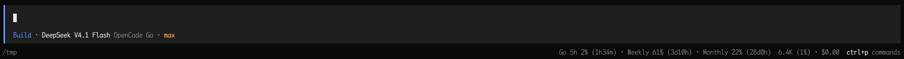

# 📊 opencode-go-statusline

[](https://www.npmjs.com/package/opencode-go-statusline)
[](https://github.com/lnwu/opencode-statusline-plugins/blob/main/packages/opencode-go-statusline/LICENSE)

**English** | [简体中文](https://github.com/lnwu/opencode-statusline-plugins/blob/main/packages/opencode-go-statusline/README.zh-CN.md)

Display your OpenCode Go subscription quota in the TUI footer statusline.



## ✨ Features

- Live **rolling 5h / weekly / monthly** usage percentages in the prompt footer
- Reset countdowns when the footer details are expanded (or the terminal is wide enough)
- Color feedback: subdued normally, info at ≥70%, error at ≥90% or when a quota window reports a non-`ok` status
- Only appears for sessions whose model provider is `opencode-go`
- Usage refreshes about once per minute
- Labels follow your terminal locale (`5h / Weekly / Monthly` or `5h / 周 / 月`), overridable with the `language` option

## 📋 Requirements

- OpenCode@2
- An active OpenCode Go credential (`opencode-go`)

## 🚀 Install

```sh
opencode plugin add opencode-go-statusline
```

## 🌐 Language

Labels follow your terminal locale by default: `zh*` locales show `5h / 周 / 月`, everything else shows `5h / Weekly / Monthly`.

Override it with the plugin's `language` option:

```jsonc title="~/.config/opencode/opencode.jsonc"
{
  "plugins": [
    { "package": "opencode-go-statusline", "options": { "language": "zh-CN" } },
  ],
}
```

| Value              | Display                                                 |
| ------------------ | ------------------------------------------------------- |
| `"auto"` (default) | Detect from `LC_ALL`, `LC_MESSAGES`, `LANGUAGE`, `LANG` |
| `"en"`             | `5h / Weekly / Monthly`                                 |
| `"zh-CN"` / `"zh"` | `5h / 周 / 月`                                          |

## 🩺 Troubleshooting

- **The statusline never shows up** — it is hidden unless the session's model provider is `opencode-go`. Switch to an OpenCode Go model in the session.
- **It shows `Go —` instead of numbers** — the `opencode-go` credential could not be resolved, or the server plugin is disabled. Check your OpenCode Go login.

## 📜 Changelog

See [CHANGELOG.md](https://github.com/lnwu/opencode-statusline-plugins/blob/main/packages/opencode-go-statusline/CHANGELOG.md) for the release history.

## 📄 License

MIT
