# 📊 opencode-kimi-code-statusline

[](https://www.npmjs.com/package/opencode-kimi-code-statusline)
[](https://github.com/lnwu/opencode-statusline-plugins/blob/main/packages/opencode-kimi-code-statusline/LICENSE)

[English](https://github.com/lnwu/opencode-statusline-plugins/blob/main/packages/opencode-kimi-code-statusline/README.md) | **简体中文**

在 OpenCode TUI 底栏显示 Kimi For Coding（Kimi Code）订阅配额用量。



## ✨ 功能

- 在输入框底栏实时显示 **滚动 5 小时 / 每周** 用量百分比（`Kimi 5h 63% · Weekly 18%`）
- 展开底栏详情（或终端足够宽）时显示重置倒计时
- 每段颜色提示：正常为弱化色，≥70% 为警告色，≥90% 为错误色
- 仅当会话模型 provider 为 `kimi-code-plan-global` 或 `kimi-code-plan-cn` 时显示
- 用量约每分钟自动刷新一次
- 标签跟随终端语言（`5h / Weekly` 或 `5h / 周`），可用 `language` 选项覆盖

## 📋 环境要求

- OpenCode@2
- 已在 OpenCode 登录 Kimi For Coding 套餐（`opencode auth login kimi-code-plan-global`；kimi.com 套餐用 `kimi-code-plan-cn`）

## 🚀 安装

```sh
opencode plugin add opencode-kimi-code-statusline
```

## 🌐 语言

标签默认跟随终端语言：`zh*` 环境显示 `5h / 周`，其他显示 `5h / Weekly`。

可用插件的 `language` 选项覆盖：

```jsonc title="~/.config/opencode/opencode.jsonc"
{
  "plugins": [
    { "package": "opencode-kimi-code-statusline", "options": { "language": "zh-CN" } },
  ],
}
```

| 取值               | 显示                                                    |
| ------------------ | ------------------------------------------------------- |
| `"auto"`（默认）   | 从 `LC_ALL`、`LC_MESSAGES`、`LANGUAGE`、`LANG` 自动检测 |
| `"en"`             | `5h / Weekly`                                           |
| `"zh-CN"` / `"zh"` | `5h / 周`                                               |

## 📈 百分比的含义

| 窗口                                | 来源            | 示例                       |
| ----------------------------------- | --------------- | -------------------------- |
| 滚动 5 小时                         | 5 小时滚动配额  | `Kimi 5h 63%`              |
| 每周                                | 7 天配额        | `Kimi 5h 63% · Weekly 18%` |
| 未登录、凭证无法解析、接口异常      | 无数据          | `Kimi —`                   |

两个百分比都是各自窗口的**已用**比例，倒计时指向各自窗口的重置时间。

## 🩺 疑难排查

- **底栏始终不显示** —— 仅当会话模型 provider 为 `kimi-code-plan-global` 或 `kimi-code-plan-cn` 时才显示，请先在会话中切换到 Kimi For Coding 模型。
- **只显示 `Kimi —` 而没有数字** —— 无法解析 Kimi For Coding 凭据，或 server 插件被禁用。请运行 `opencode auth login kimi-code-plan-global`（kimi.com 套餐用 `kimi-code-plan-cn`），然后确认插件已重新启用。
- **国际版与国内版套餐** —— `kimi-code-plan-global` 是 kimi.ai 套餐，`kimi-code-plan-cn` 是 kimi.com 套餐；插件会读取已连接的凭据，登录其中一个即可。

## 📜 变更日志

完整发布历史见 [Releases](https://github.com/lnwu/opencode-statusline-plugins/releases)。

## 📄 许可证

MIT
